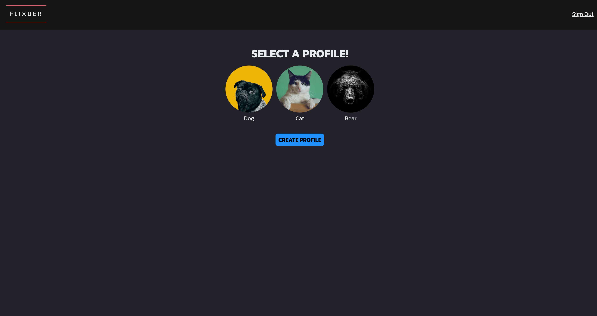

[LinkedIn](https://www.linkedin.com/in/jonathanvillagomezhernandez/) |
[Website](https://www.jonweb.dev/)

<!-- PROJECT LOGO -->
 

  <h1 align="center">Flixder</h3>

  

    Get matched with your next favorite movie!
     
    <a href="https://flixder.netlify.app/"><strong>View Demo</strong></a> | 
    <a href="https://github.com/venoblin/flixder-frontend"><strong>Front-End</strong></a>
     
  

<!-- TABLE OF CONTENTS -->

  
Table of Contents

  <ol>
    <li>
      <a href="#about-the-project">About The Project</a>
      <ul>
        <li><a href="#built-with">Built With</a></li>
      </ul>
    </li>
    <li><a href="#endpoints">Endpoints</a></li>
  </ol>

<!-- ABOUT THE PROJECT -->
## About The Project

  

  

Flixder is an application that gathers random movies from your favorite genres and displays them in cards in front of you like a dating app. If you like a movie you swipe right and gets inserted in your movies to watch list. A fun way to find new movies to watch!

(<a href="#readme-top">back to top</a>)

### Built With

* React
* SASS
* Node.js
* Express
* MongoDB

(<a href="#readme-top">back to top</a>)

## Endpoints
| Endpoint         | HTTP Verb | Description                  |
| ---------------- | --------- | ---------------------------- |
| /movies          | GET       | Gets all movies              |
| /movies          | POST      | Posts a new movie            |
| /movies/:id      | GET       | Gets one movie from our db   |
| /movies/tmdb/:id | GET       | Gets movie using its TMDB id |
| /genres          | GET       | Gets all genres              |
| /genres/:id      | GET       | Gets one genre               |
| /providers       | GET       | Gets all watch providers     |
| /providers/:id   | GET       | Gets one watch provider      |
| /regions         | GET       | Gets all watch regions       |
| /regions/:id     | GET       | Gets one watch region        |
| /images          | GET       | Gets all images              |
| /images/:id      | GET       | Gets one image               |
| /profiles        | GET       | Gets all profiles            |
| /profiles        | POST      | Posts a new profile          |
| /profiles/:id    | GET       | Get one profiles             |
| /profiles/:id    | PUT       | Updates a profile            |
| /profiles/:id    | DELETE    | Deletes a profile            |

(<a href="#readme-top">back to top</a>)

